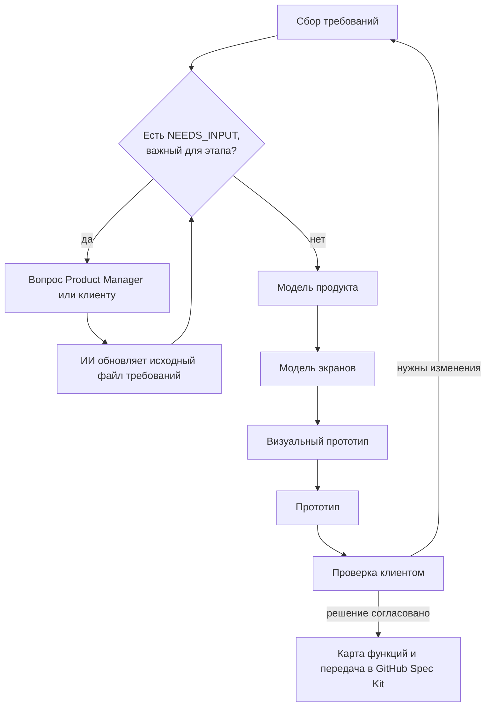

# Шаблон продукта

Это заготовка для подготовки и проверки нового продукта с помощью Product Compiler.

Product Compiler превращает исходную идею и требования в утвержденную продуктовую спецификацию, кликабельный визуальный прототип и работающий прототип. Последующие файлы архива позволяют подготовить утвержденное решение к передаче в GitHub Spec Kit и Feature SDD.

Product Compiler не генерирует финальный production-код продукта.

## Что должен сделать Product Manager

1. Скачать архив к себе локально.
2. Открыть каталог `requirements/`.
3. Заполнить требования во всех тематических папках каталога `requirements/`.
4. Внутри тематической папки можно создать один или несколько `.md`-файлов. Имена файлов нужно выбирать по содержанию, например `product-goals.md`, `user-roles.md`, `business-rules.md` или `integrations.md`. ИИ читает все файлы во всех вложенных папках `requirements/`, поэтому собирать весь раздел в одном файле не требуется.
5. Не создавать `README.md` внутри тематических папок с требованиями. Единственный служебный файл с общей инструкцией находится непосредственно в `requirements/README.md`.
6. Если для требования не хватает бизнес-решения, зафиксировать это в том же файле через блок `NEEDS_INPUT`. Не принимать профессиональные допущения вместо ответа Product Manager или клиента.
7. Не удалять тематические папки, даже если требования по теме пока не определены.
8. После подготовки исходных требований открыть каталог `docs/` и выполнять этапы по порядку. Для каждого этапа нужно открыть соответствующий документ и передать ИИ инструкцию из указанного в нем файла `ai-artifacts/prompts/`.
9. Для работы использовать ИИ-инструмент, который поддерживает работу с файлами проекта: умеет читать и редактировать существующие файлы, создавать новые файлы и выполнять длинные текстовые инструкции.
10. Основная работа Product Manager заканчивается после создания работающего прототипа на этапе `docs/04-prototype-generation.md`. Прототип передается клиенту или пользователям для проверки. По результатам обратной связи Product Manager возвращается к нужному этапу, уточняет требования и повторно формирует зависимые артефакты. Файлы этапов 05 и 06 нужны для последующей подготовки уже согласованного решения к разработке.

## Как использовать NEEDS_INPUT

`NEEDS_INPUT` ставится не на папку и не в отдельный `README.md`, а непосредственно в тот файл требований, где не хватает решения.

Рекомендуемый формат:

```md
## NEEDS_INPUT: <краткое название вопроса>

Статус: NEEDS_INPUT

Вопрос: <что именно должен решить Product Manager или клиент>

Контекст: <что уже известно>

Почему это важно: <какие требования, экраны или сценарии зависят от ответа>
```

Допускается краткая запись, если вопрос уже понятен:

```md
NEEDS_INPUT: Нужно определить, может ли пользователь отменять подтвержденный заказ.
```

Перед началом каждого этапа ИИ обязан рекурсивно прочитать все файлы в `requirements/` и проверить наличие `NEEDS_INPUT`. Если вопрос влияет на текущий этап, ИИ:

1. не придумывает ответ и не принимает профессиональное допущение;
2. создает или обновляет сводный файл `ai-artifacts/needs-input.md`;
3. задает Product Manager конкретные вопросы;
4. после получения ответа обновляет исходный файл требований, в котором был поставлен `NEEDS_INPUT`;
5. только после подтверждения Product Manager продолжает текущий этап.

Ответственность распределяется так: Product Manager или клиент принимает бизнес-решение, ИИ вносит согласованный ответ в нужный файл, Product Manager проверяет изменение.

## Структура

- `requirements/` — исходные требования к продукту;
- `docs/` — пошаговый процесс Product Compiler;
- `ai-artifacts/` — модели, отчеты, карта функций, пакет передачи и промпты для ИИ;
- `visual-prototype/` — кликабельный HTML-интерфейс без настоящего backend и базы данных;
- `prototype/` — работающий прототип с frontend, backend, API и базой данных;
- `glossary.md` — общий глоссарий.

## Где хранить

Все артефакты хранятся в GitHub в отдельном репозитории продукта. Git является основным хранилищем и историей изменений. Figma может использоваться дополнительно для чтения существующих компонентов, генерации новых макетов и компонентов и ручной доработки.

## Как работает процесс



## Быстрый старт

1. Заполните тематические папки в `requirements/`, используя осмысленные имена файлов.
2. Отметьте нерешенные бизнес-вопросы блоками `NEEDS_INPUT` в соответствующих файлах.
3. Выполните этапы 01–04 из `docs/` по порядку.
4. Передайте работающий прототип клиенту или пользователям на проверку.
5. При изменениях вернитесь к затронутому этапу и обновите зависимые артефакты.
